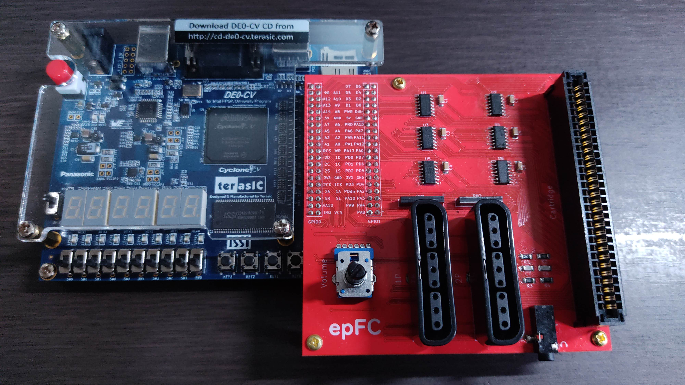

# epFC - Famicom Emulator on an FPGA

epFC is an implementation of Nintendo's __Family Computer__ (__Nintendo Entertainment System__) written in SystemVerilog.
It works on an FPGA board with a board for connection to Famicom cartridges.

It has no built-in mappers except for NROM, and can basically only operate in real-time communication with cartridges.

The operation has been confirmed with Terasic DE0-CV Board.

")

